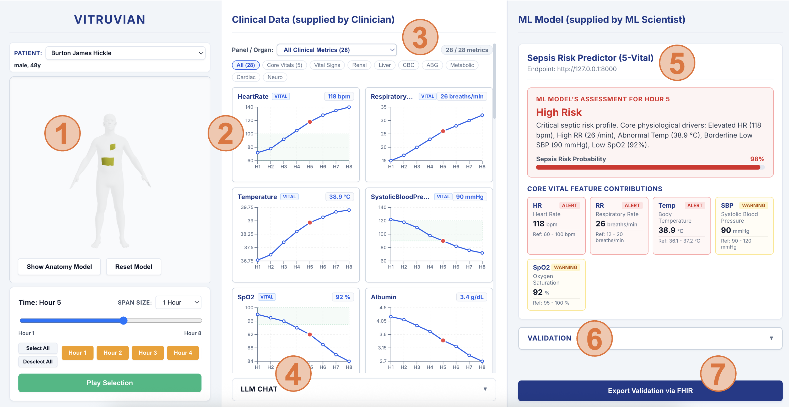

# Vitruvian
Vitruvian is a clinician-centered platform for visualizing patient anatomy from EHR data, integrating external ML predictions, and collecting expert validation feedback for continuous model improvement.

## Motivation
Modern clinical workflows generate large volumes of structured and unstructured EHR data, yet much of this information remains difficult to interpret quickly and spatially.

Vitruvian bridges this gap by transforming patient records into interactive anatomical visualizations while integrating predictive ML systems directly into the clinician workflow.

Beyond inference, Vitruvian introduces a human-in-the-loop validation pipeline, enabling clinicians to review, validate, and annotate ML outputs for future model refinement and auditability.

## Features
- Anatomical visualization of patient conditions
- EHR ingestion and parsing
- Integration with external ML models
- Model prediction dashboard
- Clinician validation workflow
- Structured annotation export (JSON)
- Human-in-the-loop AI evaluation
- Extensible plugin architecture for third-party models

## Human-in-the-Loop Validation
Vitruvian enables clinicians to validate ML-generated predictions directly within the workflow.

For each prediction, clinicians may:

- Agree with the prediction
- Disagree with the prediction
- Provide free-text justification
- Add contextual clinical observations

These annotations are exported as structured JSON records that can later be used for model retraining or other purposes.

## ML Model Integration
Vitruvian supports integration with external ML systems through a standardized prediction interface.

Models may be deployed:
- Locally
- Via REST APIs
- Via containerized inference services

Expected response format:

```json
{
  "prediction": "...",
  "confidence": 0.95
}
```

## Clinical Disclaimer
Vitruvian is intended for research and decision-support purposes only.

The platform does not replace clinical judgment, diagnosis, or treatment planning. All ML outputs must be reviewed by qualified healthcare professionals.

## Installation
Clone the repository, then
   ```bash
   cd vitruvian
   ```
### Install the backend
1. Create and activate a virtual environment (recommended):
   ```bash
   cd backend
   python -m venv venv
   # macOS: source venv/bin/activate
   # Windows: venv\Scripts\activate
   ```

2. Install dependencies:
   ```bash
   pip install -r requirements.txt
   ```
3. Set API key for the chatbot:
   * Follow [Google's instructions](https://ai.google.dev/gemini-api/docs/quickstart)
   * Set up your key in the environment
   * Keep your API key private and secure!

### Install the frontend
Install frontend dependencies:
   ```bash
   cd frontend
   npm install
   ```

## To run
### To run the backend
```bash
cd backend
python app.py
python server.py
```
### To run the frontend
```bash
cd frontend
npm run start
```

## Guide to the Graphical User Interface
Provided below is the graphical user interface (GUI) of Vitruvian, with key components labelled.



1. The anatomical visualization of ingested patient data with organ-system color-coding
1. Time-series metric charts
1. All extracted EHR data available for visualization, with common metric groupings for added convenience
1. LLM chatbot with context of the current patient
1. Example ML Model connected to Vitruvian, where inputs are automatically processed, and outputs are presented side-by-side
1. Validation panel for Human-in-the-loop audit
1. Option to export the validation for future model developments
